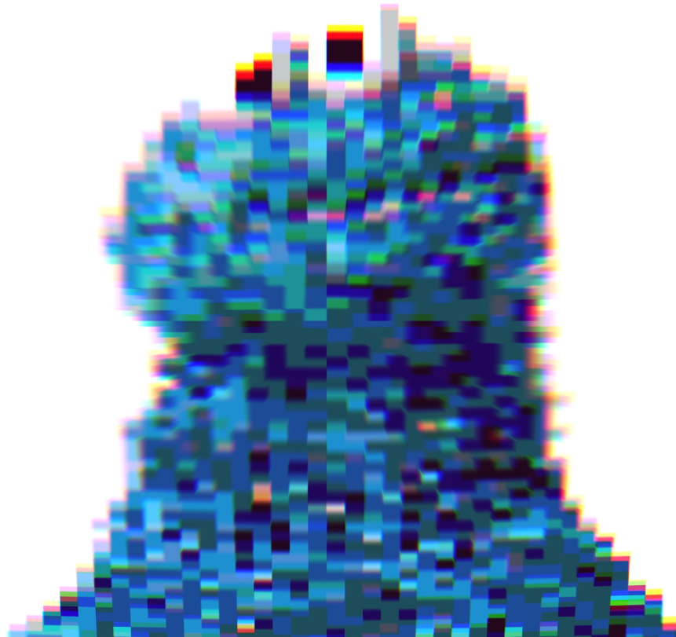

# Cookie Munger

This is a stupid idea.

It came about because of a tweet about sites that force cookies.

I looked at a site and noticed a bunch of fairly complicated cookies being stuffed into my browser. Since I work on backend stuff and know exactly how folks love to screw with anything you hand them, I decided to create something that screws with what they've given me.

ideally, you give it a URL, it fetches and analyzes the cookies the site gave you, then
turns around and dumps random crap back at the site, that are almost, but not quite like what it just got.

Because cookies are delicious and edible.

So why not let some site's demographic and analytic database enjoy a few edibles?

